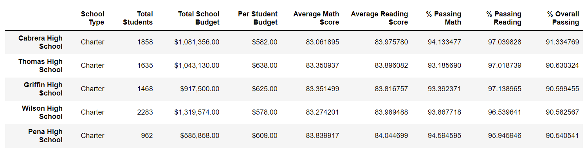

# PyCitySchools with Pandas

## Overview

The purpose of this challenge was to remove the scores of 9th grade students from Thomas High School from a dataset and then analyze the dataset to find the top 5 and bottom 5 performing schools, based on the overall passing rate, the average math score for each grade level from each school, the average reading score for each grade level from each school, and the scores by school spending per student, by school size, and by school type.

## Results

* The district summary appears unchanged. If we examine unrounded values, we can see some very small decreases in scores and passing percentages.

* For the Thomas High School row in the school summary, average math score decreased by 0.068, average reading score increased by 0.05 (apparently the 9th grade reading scores had some low outliers dragging down the mean), % passing math decreased by 0.086%, % passing reading decreased by 0.29%, and % overall passing decreased by 0.32%.

* The decrease in overall passing percentage was small enough that Thomas High School was still ranked 2nd.

* The math and reading scores by grade are unchanged, except that we no longer have any data for Thomas High School, 9th grade.

* The scores by school spending per student summary appears unchanged. If we examine unrounded values, we can see some very small decreases in scores and passing percentages in the "$631-645" bin that Thomas High School falls into.

* The scores by school size summary appears unchanged. If we examine unrounded values, we can see some very small decreases in scores and passing percentages in the "Medium (1000-1999)" bin that Thomas High School falls into.

* The scores by school type summary appears unchanged. If we examine unrounded values, we can see some very small decreases in scores and passing percentages for the "Charter" type that includes Thomas High School.

## Summary

Replacing the ninth grade scores for Thomas High School with NaNs had few noticable effects. There were no changes in the rounded district summary. In the school summary Thomas High School's overall passing rate fell from 90.95% to 90.63%, but was not enough to affect its ranking. In the math and reading scores by grade table, the 9th grade scores for Thomas High School are now listed as NaN. Finally, the rounded summaries by school spending per student, school size, and school type were unchanged.

